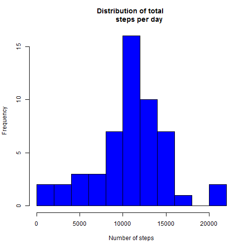
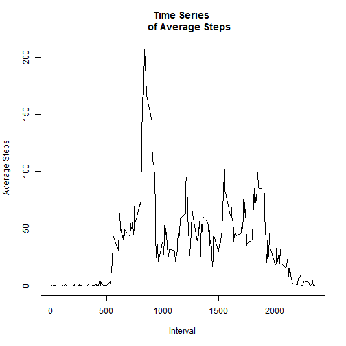
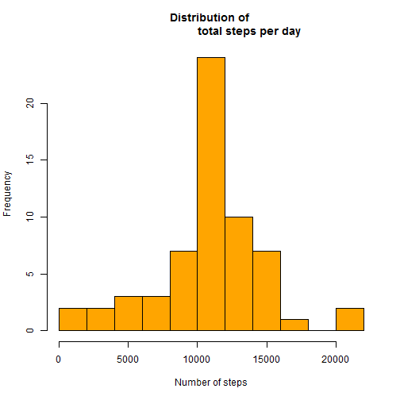
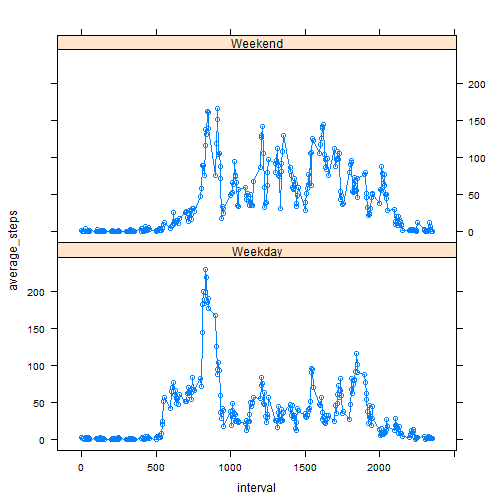

# Report on Activity Data

It is now possible to collect a large amount of data about personal movement using activity monitoring devices such as a Fitbit (http://www.fitbit.com), Nike Fuelband (http://www.nike.com/us/en_us/c/nikeplusfuelband), or Jawbone Up (https://jawbone.com/up). These type of devices are part of the "quantified self"
movement - a group of enthusiasts who take measurements about themselves regularly to improve their health, to find patterns in their behavior, or because they are tech geeks. But these data remain underutilized both because the raw data are hard to obtain and there is a lack of statistical methods and
software for processing and interpreting the data.

This report makes use of data from a personal activity monitoring device. This device collects data at 5 minute intervals through out the day. The data consists of two months of data from an anonymous individual collected during the months of October and November, 2012 and include the number of steps taken in 5 minute intervals each day.

This report aims to answer some of the questions detailed subsequently. First,
the global options are set to allow all code and output to be shown.


```r
opts_chunk$set(echo=TRUE, results="asis")
```

Read in the data and do some processing:

```r
act <- read.csv("activity.csv", header=TRUE, sep=",", stringsAsFactors=FALSE,
                na.strings="NA")

#Change column 2 to Date format

require(lubridate)
act$date <- ymd(act$date)
```


## Q1. What is mean total number of steps taken per day? 

Calculate and generate a data frame with the total number of steps taken per day 


```r
require(plyr)
act3 <- ddply(act, .(date), summarise, total_steps=sum(steps))
```


Create a histogram of the total number of steps taken each day

```r
Hist_total <- hist(act3$total_steps, breaks=8, main="Distribution of total 
        steps per day", xlab="Number of steps", col="Blue", xlim=c(0,22000))
```

 

Calculate the mean and median of the total number of steps taken per day

```r
#Calculate the mean of the total number of steps taken per day

mean(act3$total_steps, na.rm=TRUE)
```

[1] 10766.19

```r
#Calculate the median of the total number of steps taken per day

median(act3$total_steps, na.rm=TRUE)
```

[1] 10765


## Q2. What is the average daily activity pattern?

Split raw data frame "act" by intervals and calculate the mean for each. Then
plot the 5-minute interval (xaxis) and the average number of steps taken, 
averaged across all days (yaxis)


```r
act_interval <- ddply(act, .(interval), summarise, 
                      "average steps"=mean(steps, na.rm=TRUE))

plot(act_interval$interval, act_interval[,2], type="l", main="Time Series 
     of Average Steps", xlab="Interval", ylab="Average Steps")
```

 

Interval 835, on average across all the days in the dataset, contains the maximum
number of steps.

## Q3. Imputing missing values

Find the total number of missing values in the dataset

```r
sum(is.na(act$steps))
```

[1] 2304

Fill in all of the missing values in the dataset with the mean steps of that particular 5-min interval.


```r
#First replace NA values in "steps" column of original data frame with "xx".

act[is.na(act)] <- "xx"

for(i in 1:17568){
        if(act$steps[i]=="xx"){  
                act[i,1] <- act_interval[(act_interval$interval
                                                == act$interval[i]),2]
        }
}
```


Make a histogram of the total number of steps taken each day for filled-in dataset.

```r
act$steps <- as.numeric(act$steps)
act_whole <- ddply(act, .(date), summarise, total_steps=sum(steps))

#Create a histogram of the total number of steps taken each day

Hist_totalnew <- hist(act_whole$total_steps, breaks=8, main="Distribution of 
                        total steps per day", xlab="Number of steps", 
                                col="Orange1", xlim=c(0,22000))
```

 


#Calculate the new mean and median of the total number of steps taken per day

```r
#Calculate the new mean of the total number of steps taken per day

mean(act_whole$total_steps, na.rm=TRUE)
```

[1] 10766.19

```r
#Calculate the new median of the total number of steps taken per day

median(act_whole$total_steps, na.rm=TRUE)
```

[1] 10766.19

The median for the total number of steps taken per day has now increased. 
The mean remains the same as before.

Imputting the missing data brings the mean and median of the data closer
together. The new mean and median are now in fact the same. This is to 
be expected, as the missing values were filled in, which should push
the distribution of the data towards a perfectly normal distribution.


##Q4. Are there differences in activity patterns between weekdays and weekends?

Create a data frame with factor column containing "Weekday" and "Weekend"


```r
#Create lookup table for days of the week, split by weekdays and weekends

week <- data.frame(c("Monday","Tuesday","Wednesday","Thursday","Friday",
                     "Saturday", "Sunday"),c("Weekday", "Weekday", "Weekday",
                        "Weekday", "Weekday", "Weekend", "Weekend"))
names(week) <- c("day", "class")

#Create new column in dataset with the day of the week matching "date".
act$day <- weekdays(act$date)

#Match the new column with the look up table, and add the "Weekday" or "Weekend
#classification column to the original dataframe

act$dayclass <- week$class[match(act$day, week$day)]
```

Create the plot using lattice package

```r
#Create data frame with the average steps by day of week category and interval
act_factored <- ddply(act_avg, .(interval, dayclass), summarise,"average steps"
             =mean(steps, na.rm=TRUE))

names(act_factored) <- c("interval", "dayclass", "average_steps")

xyplot(average_steps ~ interval | dayclass, data=act_factored, layout=c(1,2),
       type="b")
```

 


